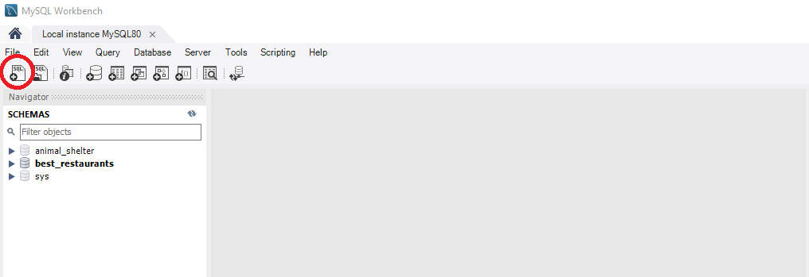

#  _Best Restaurants_

#### _A Collection of restaurants and their associated Cuisines / ratings_
##### __Created:__ 7/29/2020
##### __Last Updated:__ 7/30/2020 
##### By _**Tyson Lackey, Chris Yoon**_  


## Description

_What is a restaurant? Is it just some place with a random name, plopped in some high-traffic locale, serving trendy instagram-able dishes, held hostage by the judgement of the masses, and tied to a ten-digit number but who even calls anyone anymore? YES WE THINK SO! That's why we made the Best Restaurants application for your mouth pleasure, Enjoy sheeple!... No I've never heard of Yelp, what's that?... It does this exact thing but better?..._

## Behaviors

| Spec| Example input | Example Output
| ----------- | ----------- | ----------- |
| The program takes a user input of restaurant name, location, rating, phone number and cuisine type. | "Name: Father John's, Location: Croatia, Rating: 4, Phone Number: 555-555-5355, Cuisine: Hunan" | N/A |
| The program allows user to EDIT restaurant name, location, rating, phone number and cuisine type. | "Name: Dad John's, Location: Moatia, Rating: 5, Phone Number: 155-555-5355, Cuisine: Chengdu" | N/A |
| The program allows user to DELETE restaurant input | N/A | "Dad John's Restaurant was deleted |
| The program displays user inputs of restaurant and cuisine in a list | "Name: Father John's, Location: Croatia, Rating: 4, Phone Number: 555-555-5555, Cuisine: Hunan" | N/A |
| Behavior | input | output |


## Setup/Installation Requirements

##### &nbsp;&nbsp;&nbsp;&nbsp;&nbsp;&nbsp; Configue MySQL Workbench Database:
1. Launch MySQL Workbench
2. Select "Create a new SQL tab for executing queries"

3. Enter the following SQL into the query window and click "execute"

```
DROP DATABASE IF EXISTS: best_restaurants;
CREATE DATABASE best_restraunts;
USE best_restraunts;
CREATE TABLE `restaurants` (
  `restaurantId` int NOT NULL AUTO_INCREMENT,
  `cuisineId` int NOT NULL,
  `Name` varchar(45) NOT NULL,
  `Location` varchar(45) NOT NULL DEFAULT 'n/a',
  `PhoneNumber` varchar(45) NOT NULL DEFAULT 'n/a',
  `Rating` int NOT NULL DEFAULT '0',
  PRIMARY KEY (`restaurantId`)
);
CREATE TABLE `cuisines` (
  `cuisineId` int NOT NULL AUTO_INCREMENT,
  `Name` varchar(45) NOT NULL,
  `Region` varchar(45) NOT NULL DEFAULT 'n/a',
  PRIMARY KEY (`cuisineId`)
);

INSERT INTO `cuisines` (Name, Region)
  VALUES ('Americana',	'U.S.A')
, ('Cajun',	'Louisiana')
, ('Sushi',	'Japan')
, ('Italian (Traditional)',	'Italy')
, ('Pizza',	'Italy')
, ('TexMex',	'Southern U.S.A.')
, ('Mexican (Traditional)',	'Mexico')
, ('Mexican (Modern)',	'U.S.A.')
, ('Ethiopian',	'Ethiopia')
, ('Korean',	'South Korea')
, ('Ramen',	'Japan')
, ('Curry',	'India')
, ('Bao',	'Japan')
, ('Japanese (Traditional)',	'Japan')
, ('French (classical)',	'France')
, ('Latvian',	'Latvia')
, ('Chinese (American)',	'U.S.A.')
, ('Chinese (Traditional)',	'U.S.A.')
, ('Vietnamese',	'Vietnam')
, ('Nepalese',	'Nepal')
, ('German',	'Germany')
, ('Irish',	'Ireland')
, ('Thai',	'Taiwan')
, ('Peruvian',	'Peru')
, ('Polish',	'Poland')
, ('Greek',	'Greece')
, ('English (Traditional)',	'U.K.')
, ('hawaiian',	'Hawaii')
, ('Fusion',	'n/a')
, ('Other',	'n/a');
```

##### &nbsp;&nbsp;&nbsp;&nbsp;&nbsp;&nbsp;Open via Bash/GitBash:

1. Clone this repository onto your computer:
    "git clone https://github.com/Lackeyt/BestRestaurant.Solution"
2. Navigate into the "BestRestaurant" directory in Visual Studio Code or preferred text editor:
3. Open the project
    "code ."
4. Open your computer's terminal and navigate to the directory bearing the name of the program and containing the top level subdirectories and files.
5. Enter the command "dotnet build"in the terminal and press "Enter".
6. Enter the command "dotnet watch run" in the terminal and press "Enter".

## Known Bugs

* n/a

## Support and contact details

* Discord: TysonL#4409
* Email: lackeyt90@gmail.com


## Technologies Used

* Visual Studio Code
* HTML
* CSS
* Bootstrap
* C#
* MVC
* MySQL Workbench
* Entity Framework
* .NET Core

## Resources:

* 

### License

Copyright (c) 2020 **_Tyson Lackey, Chris Yoon_**

This software is licensed under the MIT license.